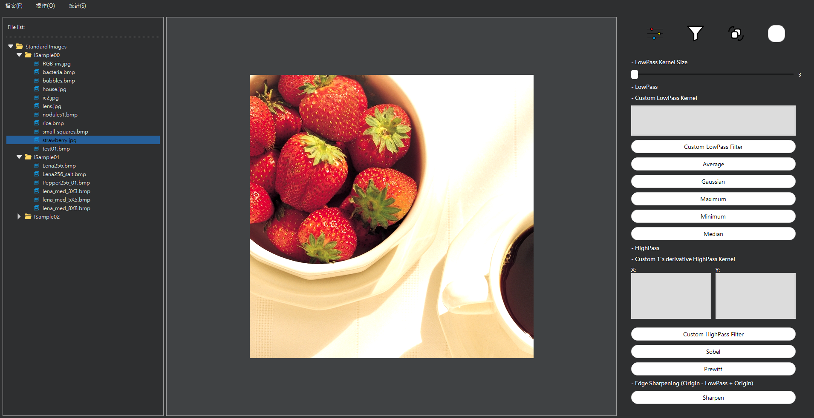

# QT6 Image Processing Software

## Description

This is my Qt practice for image processing software built with QT6, offering a wide range of functionalities for image manipulation, analysis, and enhancement. It is designed to be user-friendly and efficient, suitable for both novice users and professionals.

## Features

- **Image Loading and Saving:** Supports various image formats including JPEG, PNG, BMP.
- **Image Filtering:** Apply different filters like Gaussian Blur, Sharpen, Edge Detection, etc.
- **Color Adjustments:** Modify brightness, contrast.
- **Transformations:** Rotate, flip, resize.
- **Image Analysis:** Perform operations such as histogram analysis, object detection, and more.
- **Customizable Interface:** Easily switch between different tools and views.
- **Real-time Preview:** See the effects of adjustments in real-time.

## Installation

### Download Executable

If you prefer not to build from source, you can download the pre-built executable directly from the link below:
#### Windows
- [Download Link](https://github.com/Vope17/Qt6_ImageProcess/releases/tag/v1.0.0)

## Usage

### Loading an Image

1. Open the software.
2. Click on `File` > `Open` or `Ctrl+O` and select the directory you want to load.

### Functionality Group 

1. Brightness, Contrast, Negative adjustment.
2. Filters.
3. Enlarge/Shrink, Rotate, Threshold, Ascii Art.
4. Morphology Operation.

### Saving an Image

1. After editing, click on `File` > `Save As` or `Ctrl + S`.
2. Choose the desired format and location.

## License

This project is licensed under the GPL License.

